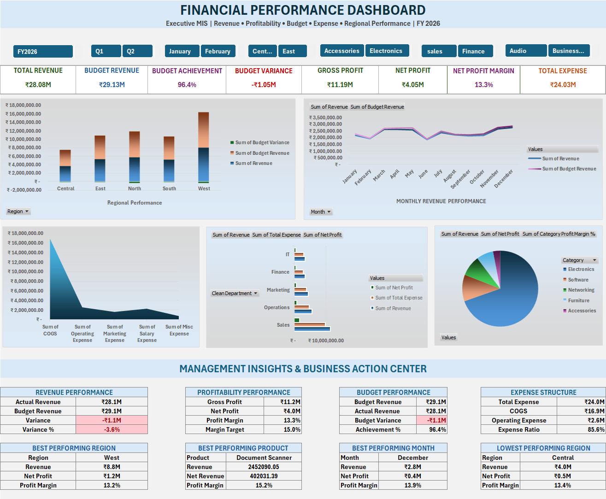
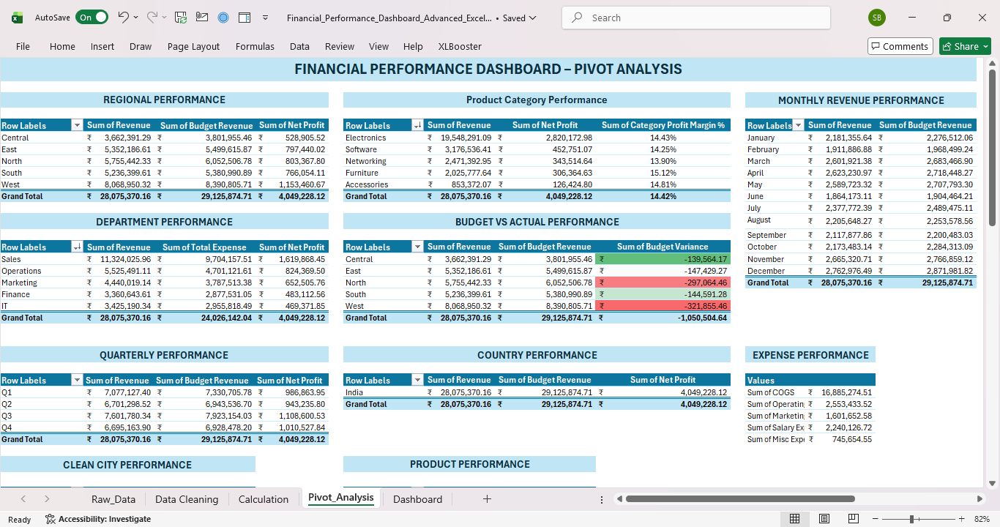
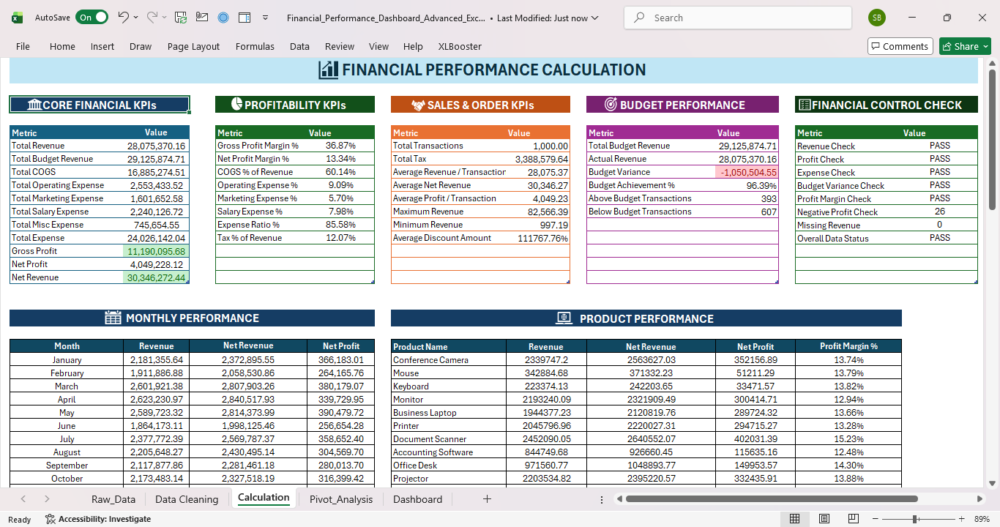
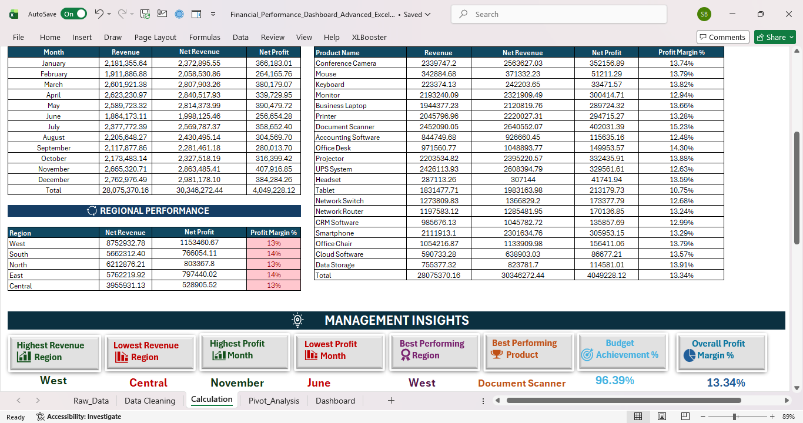

# Executive Financial Performance Dashboard (Advanced Excel)

## Project Overview

This project showcases an interactive Financial Performance & MIS Dashboard developed using Microsoft Excel. It provides management-level insights into revenue performance, profitability, expenses, budget variance, regional performance, product performance, and financial trends.

The project follows an end-to-end financial reporting workflow from raw data preparation to dashboard visualization.

---

## Features

- Interactive Financial Dashboard
- KPI Cards
- Revenue & Profitability Analysis
- Budget vs Actual Analysis
- Budget Variance Analysis
- Gross Profit & Net Profit Analysis
- Profit Margin Analysis
- Expense Analysis
- Regional Performance Analysis
- Department Performance Analysis
- Product & Category Analysis
- Monthly & Quarterly Financial Analysis
- Pivot Tables
- Pivot Charts
- Data Cleaning & Validation
- Financial Control Checks
- Management Reporting

---

## Tools Used

- Microsoft Excel
- Excel Tables
- Pivot Tables
- Pivot Charts
- Advanced Excel Formulas
- Conditional Formatting
- Data Validation
- KPI Development
- Financial Analysis
- Dashboard Design

---

## Skills Demonstrated

- Financial Data Analysis
- Data Cleaning
- MIS Reporting
- KPI Development
- Budget Variance Analysis
- Profitability Analysis
- Business Reporting
- Data Visualization
- Dashboard Development
- Advanced Excel

---

## Dashboard Preview

### Financial Performance Dashboard

### Pivot Analysis

### Calculation & KPI Analysis

---

## Workbook Structure

| Sheet | Purpose |
|---|---|
| Raw Data | Source financial transaction data |
| Data Cleaning | Data cleaning and validation |
| Calculation | KPI and financial calculations |
| Pivot Analysis | Financial analysis using PivotTables |
| Dashboard | Executive management dashboard |

---

## Key Financial Metrics

- Revenue
- Budget Revenue
- Revenue Variance
- COGS
- Gross Profit
- Operating Expense
- Marketing Expense
- Salary Expense
- Total Expense
- Net Profit
- Profit Margin %
- Net Revenue

---

## Analytical Workflow

**Raw Data → Data Cleaning → Calculations → Pivot Analysis → Dashboard**

This workflow demonstrates an end-to-end approach to financial reporting and management information systems using Microsoft Excel.

---

## Business Value

The dashboard helps management monitor financial performance, evaluate profitability, compare actual results against budget targets, analyze expenses, identify performance trends, and support data-driven business decisions.

---

## Project Type

**Advanced Excel | Financial Analysis | MIS Reporting | Dashboard Development**

---

## Author

**Sakshi Belsure**

B.Com Graduate | Aspiring MIS / Data / Financial Analyst
